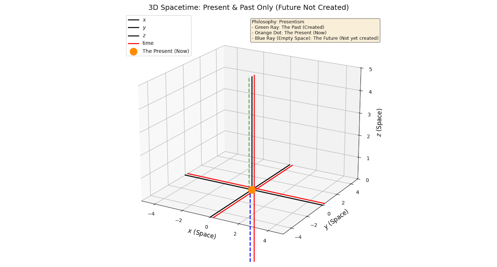
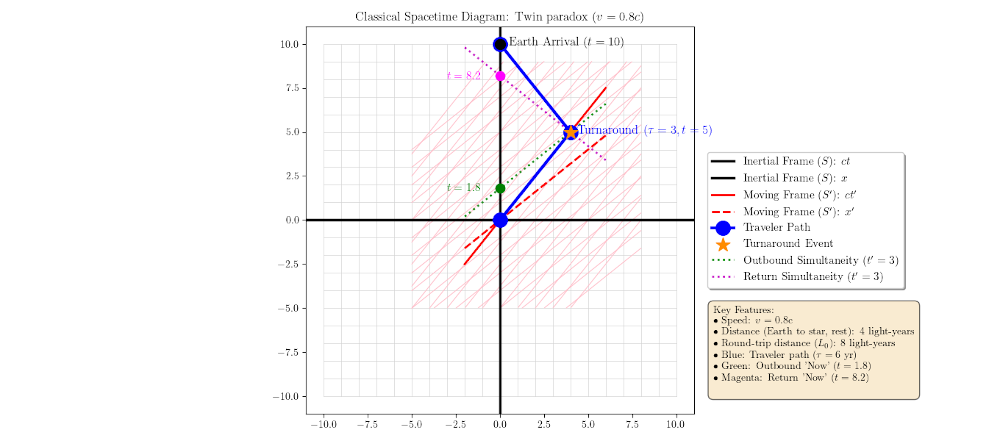
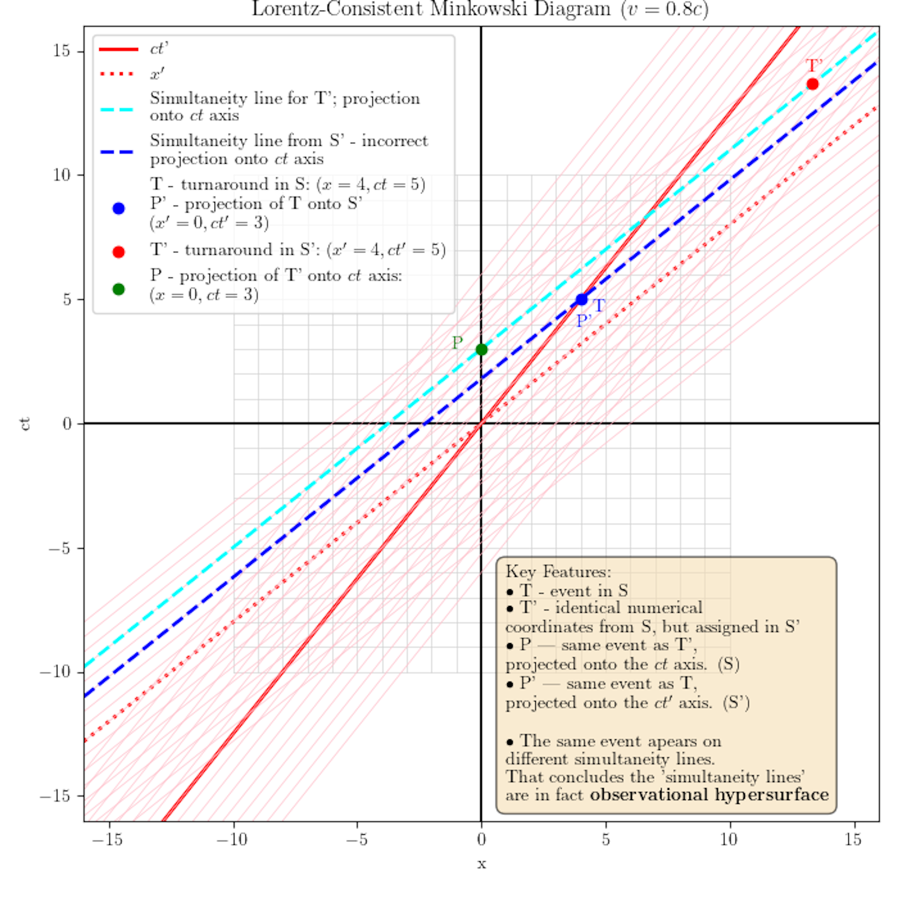
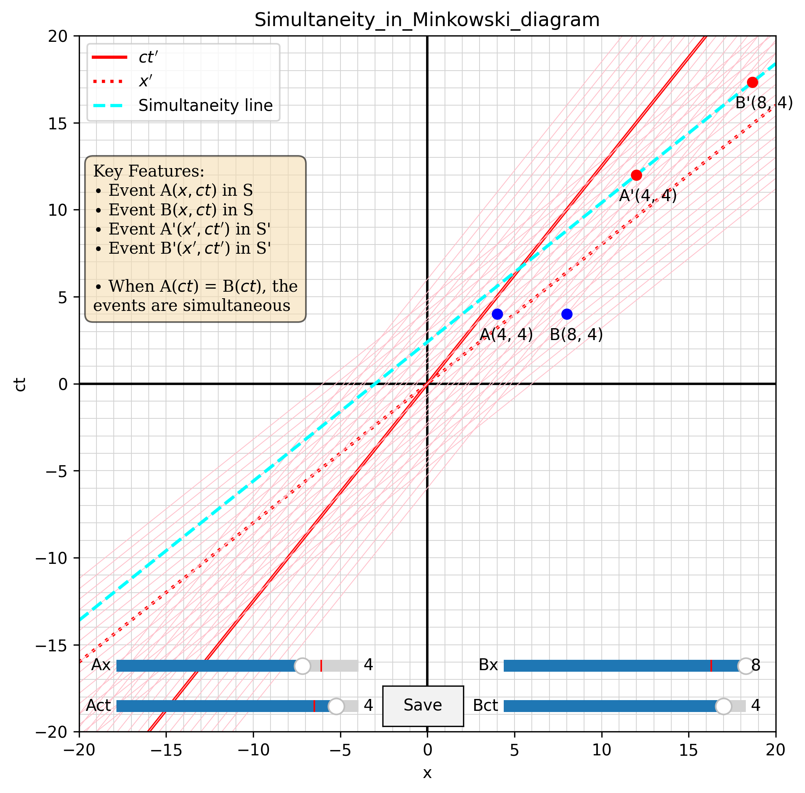

# Time-vs.-Duration-Lorentz-Consistent-Minkowski-Diagrams
A Reinterpretation of Special Relativity, simultaneity, twin paradox, spacetime diagram and spacetime.

**Author:** Ion Vlad  
**Date:** March 18, 2026  
**License:** CC BY 4.0 ([View License](https://creativecommons.org/licenses/by/4.0/))

---

## 📄 Overview

This repository contains the manuscript, supplementary materials, and Python code for the paper **"Time vs. Duration: Lorentz-Consistent Minkowski Diagrams"**

The paper challenges the conventional interpretation of Special Relativity (SR) by proposing a fundamental distinction between:
1.  **Absolute Coordinate Time ($t$):** The invariant temporal dimension of spacetime.
2.  **Relative Proper Duration ($\tau$):** The measurement of time intervals affected by velocity and acceleration.

### 🎯 Core Thesis
The apparent paradoxes of Special Relativity (such as the Twin Paradox and the relativity of simultaneity) arise not from flaws in the theory's mathematics, but from a **semantic conflation** of "time" (the dimension) with "duration" (the measurement). 

By treating **simultaneity as common reference frame** and **duration as relative**, this framework resolves these paradoxes without discarding the successful predictions of Einstein's theory. It suggests that "time dilation" is actually "duration dilation"—a measurement artefact caused by the path taken through an absolute spacetime manifold.

---

## 📂 Repository Contents

| File/Folder | Description |
| :--- | :--- |
| `Time_vs_Duration_Paper.pdf` | The full manuscript (LaTeX compiled). |
| `src/` | Python scripts used to generate the spacetime diagrams. |
| `figures/` | High-resolution images of the diagrams (PNG). |
| `README.md` | This file. |
| `LICENSE` | Creative Commons Attribution 4.0 International License. |

---
[](https://creativecommons.org/licenses/by/4.0/)

## 🖼️ Key Visualisations

The paper utilises custom-generated 3D and 2D spacetime diagrams to illustrate the arguments.

### 1. The "Presentist" Spacetime (Figure 11)
A 3D visualisation showing that the **future is not yet created**. The diagram displays only the **Past** (green ray) and the **Present** (orange dot), rejecting the "Block Universe" view.


### 2. The Twin Paradox & Simultaneity Jump
These diagrams illustrate how the shifting "plane of simultaneity" can create an apparent discontinuity—or "jump"—when coordinates are not carefully selected, and demonstrate how coordinate continuity is preserved between frames when the diagram is constructed correctly."



### 3. Absolute Simultaneity Framework
Visual proof that when reference points are chosen from both frames simultaneously, events are absolute.


---

## 🛠️ Generating the Diagrams

All diagrams in the paper were generated using Python and `matplotlib`. To reproduce them:

### Prerequisites
- Python 3.x
- `matplotlib`
- `numpy`

### Installation
```bash
pip install matplotlib numpy
